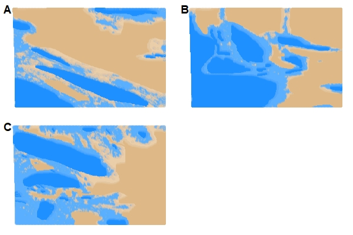

```{r setup, echo = FALSE, message = FALSE, warning = FALSE, cache = FALSE}
# load in useful packages
library(ggplot2)
library(corrplot)
library(ggpubr)
library(gridExtra)
library(plotly)
library(tidyverse)
library(patchwork)
library(RColorBrewer)
library(class)
library(ROCR)
library(caret)
library(MASS)
library(cowplot)
library(dplyr)

# set default knitr chunk
knitr::opts_chunk$set(
  echo = FALSE, 
  warning = FALSE, 
  message = FALSE,  
  cache = FALSE, 
  fig.width = 4,  
  fig.height = 2.25, 
  out.height = '75%',
  out.width = '75%', 
  fig.align = "center",  
  fig.pos = "h")
knitr::knit_hooks$set(plot = function(x, options)  {
  paste0(knitr::hook_plot_tex(x, options), "\n\\FloatBarrier\n")
})

# set working directory
setwd("~/stat-215a-lab4/")

# path
path <- "data/"

# source scripts
source("R/graphs.R")
source("R/KNN.R")

# load unzipped data
image1 <- read.table("data/image1.txt")
image2 <- read.table("data/image2.txt")
image3 <- read.table("data/image3.txt")
load("./data/SplitEachImage")

# changing column names
columns <- c("y_coord", "x_coord",
             "label", "NDAI", "SD", "CORR",
             "DF", "CF", "BF", "AF", "AN")
colnames(image1) = colnames(image2) = colnames(image3) = columns
```

# Introduction

In this report, we develop classifiers to detect the presence of clouds versus ice in arctic imagery. This problem is motivated by the study of global warming: clouds act as a natural barrier against increasing surface temperatures and hence the melting of ice in the arctic [@shi2007detection]. Our goal in what follows is to develop, evaluate, and compare several classifiers or models for predicting cloud cover. 

# Exploratory Data Analysis

## Data

Our data set consists of an ensemble of three images taken from the Multi-angle Imaging SpectroRadiometer (MISR) over the arctic, northern Greenland, and Baffin Bay. Within each of these images, there are roughly 115,000 pixels at 275-m resolution per image. Of these 115,000 pixels, approximately 70,000 are definitively labeled. From [@shi2007detection], we have that "Expert Labels are only given to those pixels of which the expert is highly confident based on his knowledge".

The data set includes the following features:

- label: Expert label of pixel - either +1 (cloud), 0 (unsure/unlabeled), and -1 (no cloud).

- y_coord: y coordinate of the image - an integer between 2 and 383. From [@shi2007detection],  $i\in\{1,\dots,384\}$. 

- x_coord: x coordinate of the image - an integer between 65 and 369. From [@shi2007detection], $j\in\{1,\dots,512\}$.

- NDAI: normalized difference angular index - computed as the difference of average radiation levels at angles DF ($60^\circ$ Zenith) and AN ($0^\circ$ Zenith). The idea here is that surface-leaving radiation is more isotropic from non-cloud surfaces than low altitude clouds. This serves as a good classifier, as it means radiation disperses more evenly to all angles from non-cloud surfaces, so that an increase in NDAI is a proxy for more uneven radiation levels and the presence of clouds. 

- SD: Standard deviation of the 64 radiation measurements for the 5th angle associated with location $(i,j)$. Clouds are generally not smooth, so the rationale for this feature is that larger standard deviations are more indicative of the presence of clouds.

- CORR: Average linear correlation of radiation measurements at different view angles - valued in $[-1,1]$. Higher CORR implies low or no clouds, while low correlation is generally associated with high clouds. This feature, if used, has to be coupled with several of the other features in order to classify clouds from non-cloud pixels.

- DF, CF, BF, AF, and AN: Radiance angle of the camera, valued in $[70.5^\circ, 60.0^\circ, 45.6^\circ, 26.1^\circ, 0.0^\circ]$, respectively. 

## NDAI

The Normalized Differential Angular Index has the functional form
$$ NDAI_{ij} = \frac{\overline{I_{i,j}^1} - \overline{I_{i,j}^2}}{\overline{I_{i,j}^1} + \overline{I_{i,j}^2}}, $$
where $\overline{I_{i,j}^1}$ is the average radiance sampled from the spectroradiometer in the Df orientation and $\overline{I_{i,j}^2}$ is the average radiance sampled in the An orientation. Both are measures of radiance and thus are positively valued. Thus, the NDAI ratio should be bounded from -1 to 1. Empirically however, we see that the histogram in Figure \ref{fig:ndaivalues} has a large bulk of the data outside the expected range.

```{r ndaivalues, eval =  TRUE, echo = FALSE, message = FALSE, warning = FALSE, cache = FALSE, fig.height = 3, fig.width = 9, fig.cap = "Distribution of NDAI Values"}
source("R/graphs.R")
p <- ggplot(rbind(image1, image2, image3), aes(NDAI)) 
p <- p + geom_histogram(binwidth = .05)
p <- p + geom_vline(xintercept = -1)
p <- p + geom_vline(xintercept = 2.3)
p <- p + theme_bw()
p <- p + theme(axis.title = element_text(size = 16), axis.text=element_text(size=14))
p <- p + theme(plot.title = element_text(size = 18, face = "bold", hjust = 0.5))
p <- p + ylab("Count")
p
```

The data outside the -1 to 1 range constitutes a vast majority of the pixels that were labeled by experts as clouds, so it is infeasible to throw out these data points. It is worth noting that this is also how the authors in [@shi2007detection] proceeded with their analysis.

## Spatial Distributions of Features

In Figure \ref{fig:plotlabels}, we look at the expert labels for the data. 

```{r plotlabels, eval =  TRUE, echo = FALSE, message = FALSE, warning = FALSE, cache = FALSE, fig.height = 3, fig.width = 9, fig.cap = "Expert Labeled MISR Data"}
source("R/graphs.R")
p1 <- classifyPlot(image1, FALSE)
p2 <- classifyPlot(image2, FALSE)
p3 <- classifyPlot(image3, FALSE)
ggarrange(p1, p2, p3, nrow = 1, common.legend = TRUE, legend = "bottom")
```

Next, in Figure \ref{fig:features}, we see that low NDAI visually correlates with non-cloud regions, and higher NDAI visually correlates with cloud or unlabeled regions. Intuitively, note that light in the visible spectrum will not be scattered preferentially on incidence with the surface of the earth (especially on a white background, like the arctic images in our dataset), which would lead to an NDAI of around 0. While we cannot be certain this fits with our data given the suspicious units, it may be off by a scaling factor. 

In contrast to the light scattered on the ground, incident light on the clouds in the visible spectrum does not scatter isotropically. This leads to a much greater difference in DF and AN and hence in our $\overline{I_{i,j}^1}$ and $\overline{I_{i,j}^2}$ terms, resulting in a larger NDAI. Moreover, this difference is why the SD column is a useful metric, as it represents $\sigma_{An}$, which is described in the paper as a quantification of the ground smoothness. This is why lower confidence pixels, i.e., those with a higher SD, appear to track the outline of the cloud segments or show the clouds themselves. For the CORR feature, we can see that high values of CORR are generally associated with cloud-free regions (but occasionally, as mentioned in [@shi2007detection], could also be associated with a low altitude cloud).

```{r features, eval = TRUE, echo = FALSE, message = FALSE, warning = FALSE, cache = FALSE, dev = "png", dpi = 150, fig.height = 9, fig.width = 9, fig.cap = "MISR Data colored by NDAI, SD, and CORR respectively"}
source("R/graphs.R")
p1 <- featurePlot(image1, image1$NDAI, "NDAI", "1", TRUE, FALSE, FALSE)
p2 <- featurePlot(image2, image2$NDAI, "NDAI", "2", TRUE, FALSE, FALSE)
p3 <- featurePlot(image3, image3$NDAI, "NDAI", "3", TRUE, TRUE, FALSE)
p4 <- featurePlot(image1, image1$SD, "SD", "1", FALSE, FALSE, FALSE)
p5 <- featurePlot(image2, image2$SD, "SD", "2", FALSE, FALSE, FALSE)
p6 <- featurePlot(image3, image3$SD, "SD", "3", FALSE, TRUE, FALSE)
p7 <- featurePlot(image1, image1$CORR, "CORR", "1", FALSE, FALSE, FALSE)
p8 <- featurePlot(image2, image2$CORR, "CORR", "2", FALSE, FALSE, FALSE)
p9 <- featurePlot(image3, image3$CORR, "CORR", "3", FALSE, TRUE, FALSE)
grid.arrange(p1, p2, p3, p4, p5, p6, p7, p8, p9, ncol = 3, widths = c(2.5, 2.5, 3))
```

## Kernel Density Plots and Boxplots of Features

Figures \ref{fig:denscloud} and \ref{fig:boxcloud} compare the distribution of the features proposed in the paper for the different classes of points (cloud, unlabeled, not cloud). Notably, we see what look like a large number of outliers and that NDAI appears to have the most visible separation of clusters.

```{r denscloud, eval =  TRUE, echo = FALSE, message = FALSE, warning = FALSE, cache = FALSE, fig.height = 3, fig.width = 9, fig.cap = "Kernel Density Plots of NDAI, SD, and CORR", fig.keep='all'}
source("R/graphs.R")
p1 <- featureDensity(image1, "CORR", FALSE)
p2 <- featureDensity(image1, "NDAI", FALSE)
p3 <- featureDensity(image1, "SD", FALSE)
ggarrange(p1, p2, p3, nrow = 1, common.legend = TRUE, legend = "bottom")
```

```{r boxcloud, eval =  TRUE, echo = FALSE, message = FALSE, warning = FALSE, cache = FALSE, fig.height = 4, fig.width = 11, fig.cap = "Box Plots of NDAI, SD, and CORR", fig.keep='all'}
source("R/graphs.R")
p1 <- boxplotCompare(image1, "CORR", FALSE)
p2 <- boxplotCompare(image1, "NDAI", FALSE)
p3 <- boxplotCompare(image1, "SD", FALSE)
grid.arrange(p1, p2, p3, nrow = 1)
```

## Contour plots of Features

In Figure \ref{fig:contour} we compared the entropy between the distributions and see which features maximize the entropy between the cloud and no cloud distributions. We see that NDAI maximizes the entropy. For the remaining features, we consider a multivariate setting and see which lead to separate clusters, along with the NDAI. We see that the other features do not lead to great separation.

```{r contour, eval = TRUE, echo = FALSE, message = FALSE, warning = FALSE, cache = FALSE, fig.height = 3.5, fig.width = 8.5, fig.cap = "2D Contour Plots with NDAI", fig.keep='all'}
source("R/graphs.R")
# looking at contour plots with NDAI to see what separates clouds from no clouds
p1 <- contourCompare(image1, "NDAI", "x_coord", FALSE)
p2 <- contourCompare(image1, "NDAI", "SD", FALSE)
p3 <- contourCompare(image1, "NDAI", "CORR", FALSE)
ggarrange(p1, p2, p3, nrow = 1, common.legend = TRUE, legend = "bottom")
```

## Radiances

In Figure \ref{fig:rad}, we present the class-conditional densities for each radiance feature from Image 1 (the other images have similar results). We see that there is a lot of overlap between the classes, so we expect the radiances to not be particularly predictive on their own.

```{r rad, eval =  TRUE, echo = FALSE, message = FALSE, warning = FALSE, cache = FALSE, fig.height = 5, fig.width = 8, fig.cap = "Kernel Density Plots for Radiances", fig.keep = 'all'}
source("R/graphs.R")
p1 <- featureDensity(image1, "DF", FALSE)
p2 <- featureDensity(image1, "CF", FALSE)
p3 <- featureDensity(image1, "BF", FALSE)
p4 <- featureDensity(image1, "AF", FALSE)
p5 <- featureDensity(image1, "AN", FALSE)
p1 + p2 + p3 + p4 + p5 + guide_area() + plot_layout(guides = 'collect')
```

### Relationship between radiances

In Figure \ref{fig:corr}, we present the Spearman correlation between each of the radiances. We see that adjacent pairs (also physically adjacent in terms of angles) are highly correlated, leading to colinearity in the data that can affect models used for prediction. 

```{r corr, eval =  TRUE, echo = FALSE, message = FALSE, warning = FALSE, cache = FALSE, out.height = '200px', out.width='200px', fig.cap = "Correlation between radiances"}
source("R/graphs.R")

bind_rows(image1, image2) %>% 
  filter(label != 0) %>%
  dplyr::select(-y_coord, -x_coord, -label, -NDAI, -SD, -CORR) %>%
  cor(method='spearman') %>%
  corrplot.mixed(upper="shade", number.cex=0.75)
```

# Classifiers

We next developed prediction models to try and determine the "Cloud" from "Not Cloud" pixels. In order to do this, we first removed the "Unlabeled" pixels from all three images. Next, we needed to decide on how to split up the data into a training data set and a testing data set. This was done in two ways.

1. For our training set, we randomly selected two-thirds of the pixels across all three images for training and saved the remaining one-third of the pixels for testing. We ensured that the ratio of class labels in both the training and testing data set were the same as those in the original data. The rationale behind this overall approach is to potentially capture more variability in the data, as all three images were taken from different locations. This could be the cause of changes in visualizations of the sky against the ground, and may allow us to make better predictions for any future data sets. All model visualizations will be shown on this data split.

2. For our training set we use image 1 and image 2 and test on image 3. As the distributions of the first and second images do not quite align with that of the third, this method will give us a better sense of a model's robustness to data that is different from what has previously been seen.

The classifiers we chose to develop on the data were k-Nearest Neighbors (kNN), a Random Forest (RF), Quadratic Discriminant Analysis (QDA), and $\ell_2$-penalized Logistic Regression. For the models that needed parameter tuning, we performed 10-fold cross-validation on the training set to select the parameter that minimized the mean cross validation error. After selection of the parameter, we ran the model on the full training data set and tested it on our testing data set.

When selecting features from the data to include in our model we first start with a small number of predictors based off our EDA to aid in classification---in particular NDAI, SD, and CORR. These features are all functions of the radiances (the 1$st$ and 5$th$ Zenith angles) that were shown to capture particular information about the clouds and their relationship to the landscape in [@shi2007detection] and also in our EDA section. We also fit models using NDAI, SD, CORR, and all 5 radiance measures as our data is not high dimensional and this would enable us to see if any of the radiances themselves will aid in the classification task, possibly when combined with other features. From our EDA section, we suspect any improvement in performance not to be dramatic one. We also choose to exclude the x- and y-coordinates from our models as they denote the locations of the pixels in the image which is not a feature that arises from the real physical landscape and clouds of interest.

In order to determine how well each individual model for a classifier performed, we calculate the AUC along with the classification accuracy on the test set.

## k-Nearest Neighbors (kNN)

A benefit of the k-Nearest Neighbors algorithm is it is a nonparametric approach and so no assumptions about the data have to be made explicit a priori. Additionally, kNN assumes that similar things exist close to one another, which is the relationship seen in our data as cloud pixels are more likely to be closer to other cloud pixels and vice versa. The main setback of this approach, however, is finding the optimal choice of $k$. While somewhat arbitrary, we can tune and select k through careful cross validation. We selected $k=41$ for our first model using three features (NDAI, CORR, and SD) and $k=3$ for our model using the same three features plus the five radiances.

The left plot in Figure \ref{fig:knnplots}, shows the ROC curves for using three features versus using all features in our kNN - both reveal very strong capability of classifying clouds from no clouds. The right plot in Figure \ref{fig:knnplots}, shows that the convex hull of cloud and no cloud predictions appear to be relatively distinct (there is some overlap for high SD and NDAI). 

```{r knnplots, eval = TRUE, echo = FALSE, message = FALSE, warning = FALSE, cache = FALSE, fig.height = 4, fig.width = 9, fig.cap = "ROC Curve and Convex Hull of Predictions"}
source("R/KNN.R")
test1 <- trainData(test_r, c("NDSI", "SD", "CORR"))
pred1 <- readRDS(file = "data/KNN_pred1.rds")
ROC_df <- readRDS(file = "data/KNN_ROC_df.rds")
# plotting ROC for both sets of features
p1  <- rocPlot(ROC_df, FALSE)
# visualizing boundary of KNN for image 3
p2 <- boundaryPlot(test1, pred1, "NDSI", "SD", FALSE)
grid.arrange(p1, p2, nrow = 1)
```

Additionally, we can look at traces of the decision boundary for our classifier. As seen below, for the most part the model generalizes well, but interpretability of the boundary and results is not straightforward. We can see that the model has no difficulty with the extreme NDAI values (below -1 and above 1), but has some trouble for points with NDAI between 0 and 1. 

```{r eval = TRUE, echo = FALSE, message = FALSE, warning = FALSE, cache = FALSE, fig.height = 2, fig.width = 4, fig.cap = "Decision Boundary for kNN"}
cloud_train <- train_r %>%
  dplyr::select(-c(x, y, SD, DF, CF, BF, AF, AN)) %>%
  filter(label == 1) %>%
  dplyr::select(-label) 
not_cloud_train <- train_r %>% 
  dplyr::select(-c(x, y, SD, DF, CF, BF, AF, AN)) %>%
  filter(label == -1) %>%
  dplyr::select(-label) 
train_df <- rbind(cloud_train, not_cloud_train)

# test data
cloud_test <- test_r %>%
  dplyr::select(-c(x, y, SD, DF, CF, BF, AF, AN)) %>%
  filter(label == 1) %>%
  dplyr::select(-label) 
not_cloud_test <- test_r %>%
  dplyr::select(-c(x, y, SD, DF, CF, BF, AF, AN)) %>%
  filter(label == -1) %>%
  dplyr::select(-label) 

# third image for testing
image3_df <- rbind(cloud_test, not_cloud_test)

# labels
cl <- factor(c(rep("Cloud", nrow(cloud_train)),
               rep("Not Cloud", nrow(not_cloud_train))))
test_cl <- factor(c(rep("Cloud", nrow(cloud_test)),
                  rep("Not Cloud", nrow(not_cloud_test))))

# creating grid
test_df <- expand.grid(x = seq(min(train_df[, 1] - 1), max(train_df[, 1] + 1), by = 0.1),
                    y = seq(min(train_df[, 2] - 1), max(train_df[, 2] + 1), by = 0.1))

# running w/ grid
classif <- knn(train_df, test_df, cl, k = 31, prob = TRUE)
prob <- attr(classif, "prob")
dataf <- bind_rows(mutate(test_df, prob = prob, cls = "Cloud",
                          prob_cls = ifelse(classif == cls, 1, 0)),
                    mutate(test_df, prob = prob, cls = "Not Cloud",
                           prob_cls = ifelse(classif == cls, 1, 0)))
test_sample <- sample(length(image3_df[, 1]), 10000)
ggplot(dataf) +
  geom_point(aes(x = x, y = y, color = cls), 
             data = mutate(test_df, cls = classif), size = 0.8) + 
  geom_contour(aes(x = x, y = y, z = prob_cls, group = cls, color = cls), bins = 3, binwidth = 0.001, 
               data = dataf) +
  geom_point(aes(x = x, y = y, fill = cls), size = 2.3, alpha = 0.8, position = "jitter", shape = 21,
             data = data.frame(x = image3_df[test_sample, 1], y = image3_df[test_sample, 2], cls = test_cl[test_sample])) +
  xlab("NDAI") + ylab("CORR") + 
  theme(text = element_text(size = 9)) + 
  guides(color = guide_legend(title = "KNN Boundary"),
         fill = guide_legend(title = "Test Actual")) 
```

## Quadratic Discriminant Analysis (QDA)

QDA (Quadratic Discriminant Analysis) models each class density as a multivariate Gaussian. As stated in [@shi2007detection], compared to other classificiation methods, QDA is more robust to errrors in the training labels because it models the joint distribution $P(s, x)$ (as opposed to other models like $\ell_2$-penalized Logistic regression which only models the conditional probability $P(s|x)$, where $s$ denotes the class and $x$ the sample). An additional benefit to QDA is it is computationally efficient as it involves only estimating the vector of means and covariance matrix. We decided to use QDA over another related classifier such as Linear Discriminant Analysis, as it offers more flexibility in the boundaries between classes which must be linear in LDA. It also allows the covariances of matrix associated to each class to be different to one another, as opposed to LDA where they must be the same. Referring back to Figure \ref{fig:denscloud} and Figure \ref{fig:rad}, we can see that the class distributions have different variances, making QDA a more natural choice. Next, we make QQ plots in Figure \ref{fig:qq} to check how well the normality assumption holds. We can see that the "Cloud" pixels in general look to follow a normal distribution, except sometimes at the tails. However, the "Not Cloud" pixels do not follow a normal distribution at all.

```{r qq, echo = FALSE, message = FALSE, warning = FALSE, dev = "png", dpi = 150, fig.height = 3, fig.width = 12, fig.cap="Normal QQ plots for the NDAI, CORR, SD features in the training set."}
library(dplyr)
library(ggplot2)
library(gridExtra)

source("R/graphs.R")
train_r <- dplyr::mutate(train_r, label=as.factor(label))
qq_ndai <- make_qq_plot(train_r, "NDSI")
qq_corr <- make_qq_plot(train_r, "CORR")
qq_sd <- make_qq_plot(train_r, "SD")
ggarrange(qq_ndai, qq_sd, qq_corr, nrow = 1, common.legend = TRUE, legend = "bottom")
```

```{r qq2, echo = FALSE, message = FALSE, warning = FALSE, dev = "png", dpi = 150, fig.height = 6, fig.width = 12, fig.cap="Normal QQ plots for the radiance features in the training set."}
library(patchwork)
source("R/graphs.R")
qq_af <- make_qq_plot(train_r, "AF")
qq_an <- make_qq_plot(train_r, "AN")
qq_cf <- make_qq_plot(train_r, "CF")
qq_df <- make_qq_plot(train_r, "DF")
qq_bf <- make_qq_plot(train_r, "BF")
qq_df + qq_cf + qq_bf + qq_af + qq_an + guide_area() + plot_layout(guides = 'collect')
#grid.arrange(qq_df, qq_cf, qq_bf, qq_af, qq_an, nrow=2, ncol=3)
```

In Figure \ref{fig:qdaplots}, we see an ROC plot and a plot of the confusion matrix, showing the classification results of the QDA model trained on the NDAI, CORR, SD.

```{r qdaplots, echo = FALSE, message = FALSE, warning = FALSE, fig.height = 6, fig.width = 7, fig.cap = "ROC Curve and Plot of Confusion Matrix"}
library(patchwork)

combined_qda_cv <- readRDS('data/qda_roc_data')
qda_roc_plot <- ggplot(combined_qda_cv) +
  geom_line(aes(x = FPR, y = TPR, group = fold, color = fold)) +
  scale_color_discrete(name = "Features", labels = c("NDAI, CORR, SD", "All")) +
  theme_bw() + theme(text = element_text(size = 9)) 

new_test <- readRDS('data/qda_confusion_data')
qda_confusion <- ggplot(new_test) + 
  list(geom_point(aes(x = x, y = y, group = confusion, color = confusion), alpha = 0.1),
                  scale_colour_manual(values = c("TP" = "yellow",
                                                "FN" = "blue",
                                                "TN" = "green",
                                                "FP" = "red",
                                                "Unlabeled" = "white")), 
                  theme(legend.position = "right", aspect.ratio = 1),
                  guides(color = guide_legend(override.aes=list(size = 2.5, alpha=0.5)),
                         color = guide_legend(title = element_blank()),
                         group = guide_legend(title = element_blank()))) +
  labs(xlab="x-coord", ylab="y-coord") +
  theme(axis.line = element_blank(),
        axis.text.x = element_blank(),
        axis.text.y = element_blank(),
        axis.ticks = element_blank(),
        axis.title.y = element_blank(),
        axis.title.x = element_blank()) + 
  theme(text = element_text(size = 12)) 

qda_roc_plot + qda_confusion
```

Points were either classified or misclassified based on their likelihood ratio with a threshold of 0.129. For a false positive rate (points classified as cloud, but actually non-cloud) of 8.17%, we see a false negative rate (points classified as non-cloud, but actually cloud) of 1.55%.

## Random Forest

When it comes to building a model in order to predict a binary outcome, we can think of a decision boundary by which we separate our prediction. This can be generalized into a decision tree with several nodes at the bottom. Moreover, we can think of an ensemble of decision trees to obtain more stable results. In this regard, it is natural to think of Random Forest (RF), a non-linear statistical model which can be seen as an ensemble of decision trees. For each decision tree, RF bootstraps the data and generates a new data set for the tree. Then, RF randomly chooses a feature to be used as the classification criterion, and computes a threshold value that best separates the data. In this paper, two hyperparameters were cross-validated: the number of variables to use in classification (mtry), and minimum size of a terminal node (nodesize). As we have eight features, cross-validation was conducted on 1 to 8 for mtry, and on 1, 10, 100, and 1000 for nodesize. The *randomForest* package in *R* was used to cross-validate and eventually build the model.

Accuracy was easy to calculate as a random forest gives exactly 1 or -1 as a predicted value. We can also compute an AUC through looking at the proportion of votes given to a pixel for being a cloud or not a cloud. In total, 32 cross-validated models showed similar accuracy. Among them, the model with 4 as mtry and 10 as nodesize showed the best average accuracy. Additionally, importance analysis showed that variables with high mean decrease accuracy are NDAI (100.5), SD (32.8), CORR (31.57). However, when the random forest was trained by image 1 and image 2 then tested on image 3, it showed 0.641 accuracy and 0.536 AUC. This may be attributable to the distinct distribution of data in image 3 and possible overfitting of the random forest model. In Figures \ref{fig:rfimages1} and \ref{fig:rfimages2}, we see the misclassified points in each of the two different data splits.

```{r, rfimages1, eval = TRUE, echo = FALSE, message = FALSE, warning = FALSE, cache = FALSE, out.height = '200px', out.width='200px', fig.align = "center", fig.cap="2/3 Split Missclassified Points"}
knitr::include_graphics("data/rf_results-1.pdf")
```

```{r, rfimages2, eval = TRUE, echo = FALSE, message = FALSE, warning = FALSE, cache = FALSE, out.height = '200px', out.width='200px', fig.align = "center", fig.cap="Image Split Missclassified Points"}
knitr::include_graphics("data/rf_results-2.pdf")
```

## L2-penalized logistic regression

An $\ell_2$-penalized logistic regression model is a penalized generalized linear model wherein the log of the odds ratio is a linear function of the features. That is, the log of the odds ratio is a continuous response that we fit with ordinary least squares. The $\ell_2$ penalty acts as a regularizer and acts to improve the conditioning of the moment matrix: in this setting, we know that some of our features are functions of others, so we expect a high degree of colinearity. Using a penalized model will produce more stable solutions than not. This model assumes that the samples are independent; since our data are spatial, they clearly are not. We expect that neighboring pixels are not independent (we may reason that knowing that a pixel is part of a cloud increases the likelihood that its neighbors are also part of a cloud). Moreover, this model assumes that the log of the odds ratio is a linear function of the features We have no way to know a priori whether the odds ratio behaves as assumed and our features exhibit high degrees of colinearity; as we are only interested in prediction and not inference, we will not interpret the coefficients of our logistic regression or how individual features affect the response. In Figure \ref{fig:l1lrplots}, on the left we see the ROC curves associated to each model. Each have extremely similar performance as the curves are almost entirely overlapping. In Figure \ref{fig:l1lrplots}, on the right we see that a low $\lambda$ value corresponds to the best cross-validated accuracy. This means that we need very little regularization in our model.

```{r l1lrplots, echo = FALSE, message = FALSE, warning = FALSE, fig.height = 3, fig.width = 8, fig.cap="ROC Curve and CV Accuracy v. Lambda"}
tprfpr <- readRDS("data/L1LR_tprfpr.rds")
p = ggplot(tprfpr, aes(x=fpr, y=tpr, group = fold, color = fold))
p = p + geom_abline(slope=1, intercept=0, size=1)
p = p + geom_line(aes(color = fold), size = 1)
p = p + scale_color_manual(name = "Model", labels = c("NDAI, SD, CORR", "All"), values=c("brown", "dodgerblue"))
p = p + labs(x="FPR", y="TPR")
p = p + theme_bw(18)
p = p + theme(legend.text = element_text(size = 12), axis.title = element_text(size = 10), axis.text=element_text(size = 12))
p1 = p

df_cv <- readRDS("data/L1LR_df_cv.rds")
p = ggplot(df_cv, aes(x=lambda, y=cv, group = fold, color = fold))
p = p + geom_point(aes(color = fold), size = 1.5)
p = p + labs(x="Lambda", y="CV Accuracy") 
p = p + scale_color_manual(name = "Model", labels = c("All", "NDAI, SD, CORR"), values=c("dodgerblue", "brown"))
p = p + scale_x_continuous(trans = "log10")
p = p + theme_bw(18)
p = p + theme(legend.text = element_text(size = 12), axis.title = element_text(size = 10), axis.text=element_text(size = 12))
p2 = p

ggarrange(p1, p2, nrow = 1, common.legend = TRUE, legend = "bottom")
```

## Final Model Selection

The following tables summarize the performance of 4 classifiers on the test set, which was separated from the training set before classifiers were developed. 

Results for training on 2/3rds of the data randomly chosen and testing on the remaining 1/3 of data. 

|          |  KNN  |  QDA  |  RF   | Ridge |
|:---------|:-----:|:-----:|:-----:|------:|
| AUC      | 0.974 | 0.954 | 0.971 | 0.950 |
| Accuracy | 0.921 | 0.906 | 0.917 | 0.904 |

Table: AUC and accuracy of 4 classifiers when only 3 variables (NDAI, CORR, SD) were used.

|          |  KNN  |  QDA  |  RF   | Ridge |
|:---------|:-----:|:-----:|:-----:|------:|
| AUC      | 0.998 | 0.963 | 0.993 | 0.953 |
| Accuracy | 0.993 | 0.917 | 0.960 | 0.901 |

Table: AUC and accuracy of 4 classifiers when all variables except x, y coordinates were used.

Results for training on images 1 and 2 and testing on image 3.

|          |  KNN  |  QDA  |  RF   | Ridge |
|:---------|:-----:|:-----:|:-----:|------:|
| AUC      | 0.916 | 0.888 | 0.877 | 0.899 |
| Accuracy | 0.853 | 0.822 | 0.819 | 0.842 |

Table: AUC and accuracy of 4 classifiers when only 3 variables (NDAI, CORR, SD) were used.

|          |  KNN  |  QDA  |  RF   | Ridge |
|:---------|:-----:|:-----:|:-----:|------:|
| AUC      | 0.829 | 0.907 | 0.536 | 0.898 |
| Accuracy | 0.814 | 0.827 | 0.641 | 0.764 |

Table: AUC and accuracy of 4 classifiers when all variables except x, y coordinates were used.

From the 4 classifiers above, we choose the QDA classifier as our final classifier. Note that kNN had the best overall performance, but was too computationally intensive for us to run as our classifier when performing stability analysis in the limited time frame we had. The random forest model produced vastly different results depending on the training/test data split chosen and as such was unstable. The $\ell_2$-regularized regression performance metric point estimates were slightly lower the QDA but likely not significantly so. However, QDA seemed a more natural choice of model for our data given our reasoning in above sections and is much more computationally efficient and is parameter free (besides a threshold).

# Post-Hoc EDA

## Classification 

Now, we restore and include unlabeled data points to see whether our final model performs continuously on data points. Figure \ref{fig:unlabeled_qda} shows that our final model predicts unlabeled data points continuously according to the expert labels. This shows that unlabeled points alongside clouds tend to be classified as clouds and those alongside not-cloud regions tend to be classified as not cloud, as one would hope to see. This suggests that our classifier also performs in a sensible way when classifying unlabeled points, as we do not see discontinuous predictions, where in a narrow unlabeled region between cloud and not cloud we predict alternating sequences of (cloud, not cloud, cloud, not cloud, etc.).

```{r, eval = TRUE, echo = FALSE, message = FALSE, warning = FALSE, cache = FALSE, fig.align='center'}
# Data without unspecified label (0)
image1_c = image1 %>% filter(label != 0)
image2_c = image2 %>% filter(label != 0)
image3_c = image3 %>% filter(label != 0)
colnames(train_r) = colnames(test_r) = columns

qda_final <- qda(label ~ NDAI + SD + CORR + DF + CF + BF + AF + AN, data = train_r)
pred_img1 = predict(qda_final, type = "prob", newdata = image1)
pred_img2 = predict(qda_final, type = "prob", newdata = image2)
pred_img3 = predict(qda_final, type = "prob", newdata = image3)
image1$pred = as.numeric(as.character(pred_img1$class))
image2$pred = as.numeric(as.character(pred_img2$class))
image3$pred = as.numeric(as.character(pred_img3$class))
```

```{r unlabeled_qda, fig.height = 4, fig.width = 5, echo = FALSE, message = FALSE, warning = FALSE, fig.cap = "Prediction of QDA final model for unlabeled data for (A) image1 (B) image2 (C) image3. Expert labels are shown with vivid color, and predicted labels for unlabeled data are shown with faded color. Blue and brown indicates cloud and not cloud, respectively."}

```

## Stability Analysis

Next, to ensure our final QDA model is stable, we performed a stability analysis with perturbed data. Since our model development is based on a random split of train set and test set, we repeated the same process with 400 random splits. From the experiment, we find the 95% bootstrapped confidence intervals of the AUC and accuracy on the test set are (0.9676, 0.9701) and (0.8767, 0.8810), respectively. These intervals are narrow, and lead us to believe that we can expect similar values of the AUC and accuracy when we apply our final model on future data. 

# Conclusions

We have analyzed image data and developed classifiers that predict whether a pixel lies within a cloud or outside. We developed and compared the performance of several methods (penalized regression, random forest, k-NN, and QDA) before choosing QDA as our final model due to its high AUC and stability in performance across the two different ways we trained and tested models. We have tested our final classifier and found that it is stable: rerunning on various subsets of the data produces similar results. Moreover, we have found that our final model performs extremely well, with a high AUC and accuracy. Hence, we anticipate that our results and model will be useful for analyzing future data, especially as the confidence intervals are narrow.

## Division of Labor

Mark did the exploratory data analysis, implemented a k-NN classifier, and offered numerous figure edits. Sahil did the exploratory data analysis and implemented the QDA classifier. Hyunsuk implemented the random forest classifier, performed post-hoc analysis, and added in tables of model performances to the paper. Florica coordinated the project, edited others results as they came in, implemented the $\ell_2$-penalized logistic regression classifier, did numerous figure edits, and edited and wrote much of the final report.

# References

